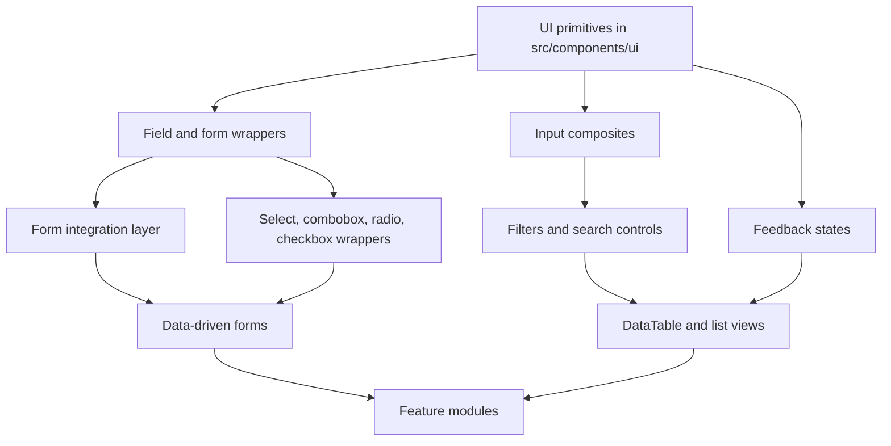

# Custom UI Architecture

Use this guidance when adding or evolving components in `src/components/custom` or when feature modules consume those components.

## Goals

- Preserve the existing scaffolded components in `src/components/custom` without rewriting or replacing them.
- Standardize all new backend-oriented UI components around accessibility, composability, and type safety.
- Keep presentation, headless behavior, data access, and business rules separated.
- Prefer wrappers, composition, slots, render props, hooks, and context over hardcoded feature logic.
- Support asynchronous flows consistently: loading, empty, error, pagination, sorting, filtering, searching, and optimistic updates.

## Must-Customize Components

Prioritize custom wrappers and shared composites around these shadcn/ui building blocks first:

- `field`, `label`, `input`, `textarea`, `input-group`, `button` for all form surfaces.
- `select`, `native-select`, `combobox`, `radio-group`, `checkbox`, `switch`, `slider` for choice and filter controls.
- `popover`, `command`, `dialog`, `sheet`, `drawer`, `dropdown-menu`, `tooltip` for overlay-driven interactions.
- `table`, `data-table`, `pagination`, `badge`, `item`, `card` for data display and browsing.
- `skeleton`, `spinner`, `progress`, `empty`, `alert`, `toast`, `sonner` for async and status feedback.
- `tabs`, `separator`, `scroll-area`, `resizable`, `breadcrumb`, `sidebar` for layout and navigation surfaces when needed.

Build shared custom components around those primitives before adding feature-specific wrappers. If a shadcn component already exists in `src/components/ui`, extend it through composition rather than replacing it.

## Architecture Rules

- Keep reusable UI in `src/components/custom/**` and low-level primitives in `src/components/ui/**`.
- Keep API calls, query keys, server actions, and domain transforms outside component files.
- Put feature-specific data shaping in feature modules, not in shared UI components.
- Expose headless state through hooks or render props when a component needs orchestration beyond simple presentation.
- Prefer thin wrappers over forked implementations when a scaffolded component already exists.
- Introduce shared utilities only when logic is reused by at least two distinct features.

## Component Design Conventions

- Use controlled and uncontrolled patterns explicitly; choose one as the default and document the other.
- Prefer consistent prop names across components: `value`, `defaultValue`, `onValueChange`, `onSelect`, `onCheckedChange`, `disabled`, `loading`, `error`, `empty`, `items`, `page`, `pageSize`, `sort`, `filter`, `search`.
- Emit semantic events rather than generic callbacks when the action matters to the caller.
- Keep component APIs narrow; do not expose internal implementation details unless they are stable extension points.
- Accept `className`, `style`, and `data-*` passthrough only when the component is meant to be composed.
- Use TypeScript generics for item and row models where the component represents structured data.

## State And Data Flow

- Separate data fetching from rendering. UI components should consume prepared state, not fetch directly.
- Keep async state in a wrapper or hook that returns `status`, `data`, `error`, `retry`, and empty-state metadata.
- Model loading, empty, and error states as first-class variants instead of ad hoc conditionals.
- Keep optimistic update logic in mutation layers or feature hooks.
- Avoid duplicating filtering, sorting, and pagination logic inside multiple components.

## Forms And Validation

- Use a single form adapter layer for form library integration.
- Map each field to the same contract: `name`, `value`, `onChange`, `onBlur`, `disabled`, `invalid`, `errorMessage`.
- Surface validation messages through dedicated field primitives, not by embedding custom error markup in every form.
- Keep accessible labels, descriptions, hints, and errors aligned with the field control.
- Prefer schema-driven validation at the feature boundary and presentation-only state inside reusable fields.

## Accessibility

- Meet WCAG expectations for labels, roles, focus order, keyboard interaction, contrast, and disabled states.
- Every interactive component must define keyboard behavior and focus management.
- Use ARIA only when native semantics are insufficient.
- Make empty, loading, and error states perceivable to assistive technology.
- Do not hide required information behind hover-only affordances.

## Theming And Responsiveness

- Use tokens or shared utility classes rather than hardcoded colors and spacing.
- Make responsive behavior an explicit part of the component contract when layout changes at breakpoints.
- Keep variant support narrow and named by intent, not by implementation detail.
- Prefer theme-aware wrapper components over duplicating styles across features.

## Folder Structure

- `src/components/ui/`: primitive design-system building blocks.
- `src/components/custom/`: reusable composed components and feature-agnostic composites.
- `src/components/custom/data/`: table, select, filters, pagination, and similar data-facing controls.
- `src/components/custom/form/`: form adapters, field wrappers, validation helpers.
- `src/components/custom/feedback/`: loading, toast, empty state, error state, progress.
- `src/components/custom/inputs/`: input variants and control composites.
- `src/features/<feature>/`: feature-specific orchestration, queries, mutations, and transforms.

## Build Order

1. Foundational primitives: button, input, label, field, select, checkbox, radio, dialog, dropdown, popover.
2. Form adapters: field wrappers, validation wiring, controlled/uncontrolled bridges.
3. Data controls: pagination, filter chips, search inputs, sorting controls, table shell.
4. Composite async patterns: empty states, loading skeletons, error panels, retry actions.
5. Feature-facing orchestration: autocomplete, combobox, command menus, data tables with server-driven state.
6. Cross-cutting utilities: query-state helpers, selection models, URL sync helpers, optimistic mutation helpers.

## Dependency Graph



## Example Usage Patterns

```tsx
// Feature module owns data fetching and passes prepared state down.
function UsersPage() {
  const usersQuery = useUsersQuery({ page, search, sort })

  return (
    <UsersTable
      rows={usersQuery.data?.rows ?? []}
      loading={usersQuery.isPending}
      error={usersQuery.error}
      emptyTitle="No users found"
      onRetry={usersQuery.refetch}
    />
  )
}
```

```tsx
// Reusable form field wrappers should adapt form state without owning business rules.
<FormField
  form={form}
  name="email"
  label="Email"
  description="Used for login and notifications"
>
  {({ inputProps, isInvalid }) => <Input {...inputProps} aria-invalid={isInvalid} />}
</FormField>
```

```tsx
// Shared controls should expose selection, not fetching.
<DataSelect
  value={status}
  onValueChange={setStatus}
  items={statusOptions}
  loading={isLoadingStatuses}
  emptyLabel="No statuses available"
/>
```

## When To Reuse Versus Specialize

- Create a reusable component when the interaction pattern, accessibility contract, and state model repeat across multiple features.
- Keep logic feature-specific when labels, validation, query params, permissions, or data transforms are unique to one domain.
- If a component needs domain knowledge to work correctly, move that knowledge into a wrapper or feature hook instead of the shared component.

## Anti-Patterns

- Do not put API calls inside shared UI components.
- Do not encode feature-specific labels, endpoints, or business rules in reusable components.
- Do not copy scaffolded components and then drift them independently without a clear abstraction reason.
- Do not expose internal DOM structure as a public API unless absolutely necessary.
- Do not implement loading, empty, and error states inconsistently between components.
- Do not duplicate form, selection, or pagination logic in feature code.
- Do not add new shared abstractions until the pattern is repeated and stable.

## Maintenance Notes

- Extend the current scaffold through composition or thin wrappers first.
- Prefer small, reviewable increments over large replacements.
- When a component gains new behavior, update the examples and dependency assumptions in this file.